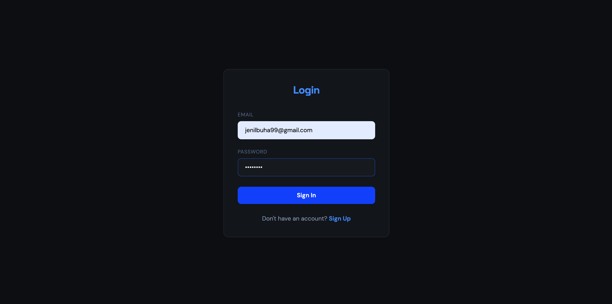
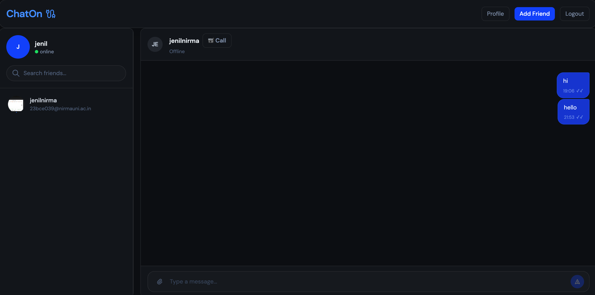
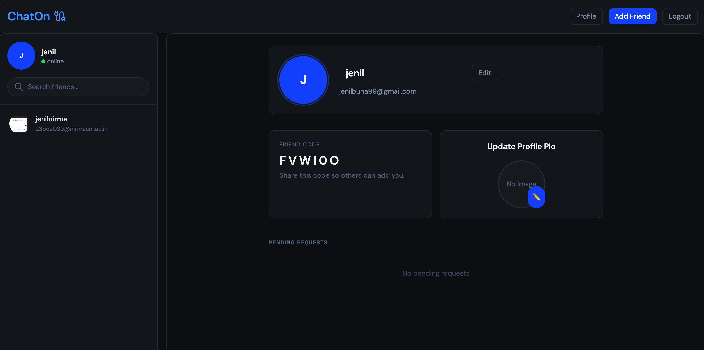
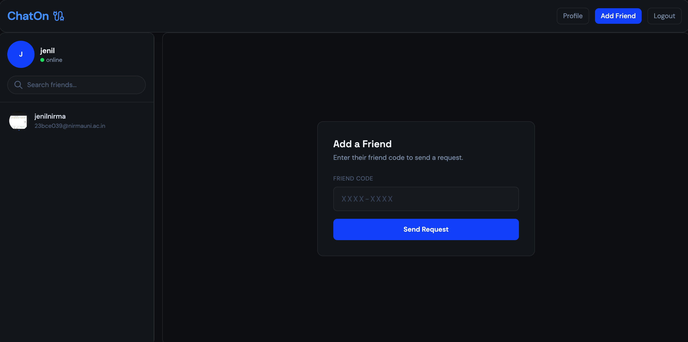
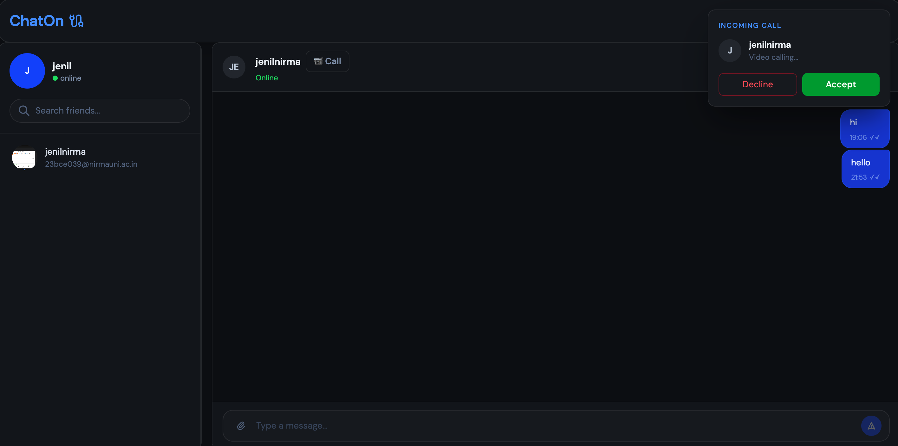
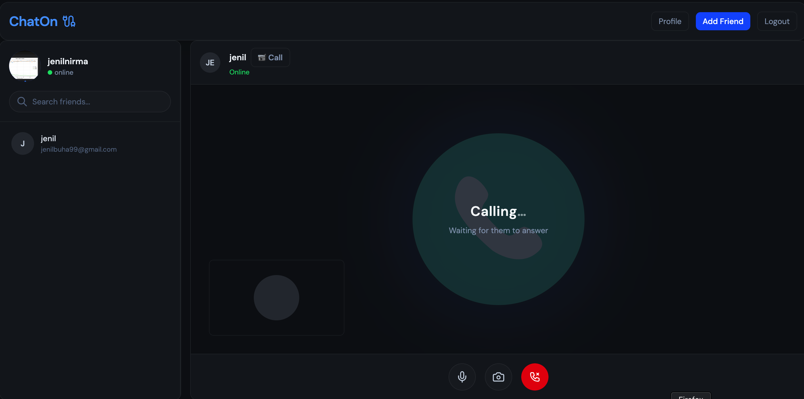
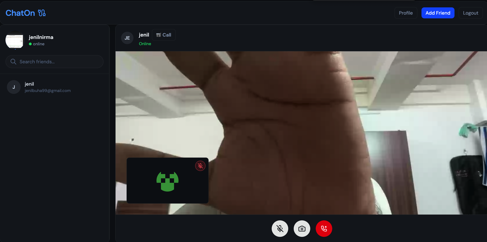

<div align="center">
  <br />
  <a href="https://chat-app-phi-gilt-85.vercel.app/" target="_blank">
    
  </a>
  <br />

  <div>
    
    
    
    
    
    
  </div>

  <h3 align="center">Real-Time Chat Application</h3>
   <div align="center">
     A full-stack, enterprise-grade real-time chat application built with the MERN stack, featuring instant messaging, rich presence, and secure authentication.
    </div>
</div>

## 📖 Table of Contents
- [Features](#-features)
- [Non-Functional Requirements (NFRs)](#-non-functional-requirements-nfrs)
- [Screenshots](#-screenshots)
- [Tech Stack](#-tech-stack)
- [Architecture & Data Flow](#-architecture--data-flow)
- [Getting Started](#-getting-started)
- [API Documentation](#-api-documentation)

---

## ✨ Features
- **Real-Time Messaging**: Built on top of Socket.io for bi-directional, low-latency communication.
- **Secure Authentication**: JWT-based authentication using HttpOnly cookies to prevent XSS attacks.
- **Offline Message Queueing**: Messages sent to offline users are queued and instantly delivered upon their return.
- **Responsive Modern UI**: Designed with TailwindCSS v4 and animated using Framer Motion and Lottie React.
- **Image Sharing**: Seamless media management using Cloudinary integration.
- **State Management**: Centralized application state handling using Redux Toolkit.

## 🛡️ Non-Functional Requirements (NFRs)
- **Rate Limiting**: Integrated `express-rate-limit` on the backend to prevent brutal force login attempts and mitigate DDoS attacks, ensuring high availability.
- **Security & Data Privacy**: 
  - Passwords are salted and securely hashed via `bcrypt`.
  - CORS is tightly configured to only allow requests from whitelisted frontend origins.
  - JWT tokens are strictly maintained securely in HttpOnly, SameSite cookies.
- **Performance**: High concurrency handling enabled by the non-blocking Node.js event loop, supplemented by Redis caching (where applicable).
- **Scalability**: Decoupled Monorepo structure allows frontend and backend services to scale independently (e.g., separating Vercel for static CDN and Render for WebSocket API).

---

## 📸 Screenshots

> **Note**: Place your screenshot images in an `assets` folder at the root of the project to display them below.

### 1. Authentication (Login / Signup)


### 2. Main UI (Chat & Layout)


### 3. Add Friend / User Search


### 4. User Profile / Settings


### 5. Video Calling



---

## 💻 Tech Stack

### Frontend (Client-side)
- **Framework**: React 19 + Vite
- **Styling**: Tailwind CSS v4
- **State Management**: Redux Toolkit
- **Routing**: React Router DOM (v7)
- **Animations**: Framer Motion & Lottie React
- **WebSockets**: Socket.io-client

### Backend (Server-side)
- **Runtime**: Node.js
- **Framework**: Express.js
- **Database**: MongoDB (Mongoose ORM)
- **WebSockets**: Socket.io
- **Media Storage**: Cloudinary & Multer
- **Security**: JWT, Bcrypt, Cookie-Parser, CORS
- **Caching**: Redis

---

## 🏗 System Architecture & Data Flow

### The Monorepo Structure
```bash
/ (project root)
├─ backend/            # Express API server (Render)
│  ├─ models/          # DB Schemas (User, Message, Pending)
│  ├─ routes/          # API Endpoints (Auth, etc.)
│  ├─ socket/          # Socket.io connection & event handlers
│  ├─ index.js         # Server entry point
│  └─ package.json     
└─ chatapp/            # React frontend (Vercel)
   ├─ src/
   │  ├─ components/   # UI elements (LoginForm, SignupForm)
   │  ├─ store/        # Redux store (userSlice)
   │  └─ main.jsx      # Router & Mount
   └─ package.json     
```

### Complete Application Flow

#### 1. Authentication & Session Initialization
- **REST Handshake**: When a user registers or logs in via `/api/auth/login`, the backend verifies the credentials using `bcrypt` and generates a secure JSON Web Token (JWT).
- **HttpOnly Cookies**: The JWT is immediately packed into an `httpOnly, sameSite: strict` cookie. This makes the application immune to Cross-Site Scripting (XSS) token extraction.
- **Client Bootstrap**: The React frontend securely routes the user to the protected dashboard, pulling immediate user metadata and friends lists via REST.

#### 2. Real-Time WebRTC & Socket.io Lifecycle
- **WebSocket Upgrade**: Upon successful dashboard mount, `socket.io-client` initiates an upgrade to WebSockets using the `socket.io` backend port. The user's `userId` is mapped to their unique `socket.id` in server memory.
- **Presence & Status**: Other connected clients in the user's friend list are instantly notified of the user's 'Online' status.
- **Active Chatting**: Direct messages are emitted as `sendMessage` events. The server intercepts these, logs them into MongoDB, and immediately pushes a `newMessage` event to the recipient's socket if they are online.
- **Peer-to-Peer Video Calling**: For video calls, Socket.io is used purely as a signaling server to exchange `offer`, `answer`, and `ice-candidate` packets before establishing a direct WebRTC peer connection for streaming high-bandwidth video and audio.

#### 3. Offline Message Delivery Queue
- **Pending Model**: What if a user sends a message to an offline friend? The server gracefully identifies the missing connection and pushes the payload to a `PendingMessage` database model.
- **Queue Flush**: The next time that offline user connects, the Socket lifecycle queries the `PendingMessage` table, instantly dispatches all missed messages, and flushes the queue—guaranteeing 100% delivery.

---

## 🚀 Getting Started

### 1. Prerequisites
Ensure you have the following installed on your machine:
- [Node.js](https://nodejs.org/en/) (v18+)
- [MongoDB](https://www.mongodb.com/) (Local or Atlas URL)
- [Redis](https://redis.io/) (Optional, for caching layer)

### 2. Installation
Clone the repository:
```bash
git clone https://github.com/yourusername/chatapp-project.git
cd chatapp-project
```

Install dependencies for **both** folders:
```bash
# Terminal 1 - Backend
cd backend
npm install

# Terminal 2 - Frontend
cd chatapp
npm install
```

### 3. Environment Variables

Create `.env` files in both directories. 

**Backend (`backend/.env`)**
```env
PORT=3000
NODE_ENV=development
MONGODB_URI=your_mongo_database_uri
JWT_SECRET=your_super_secret_jwt_key
FRONTEND_URL=http://localhost:5173
```

**Frontend (`chatapp/.env`)**
Note: Vite environment variables must start with `VITE_`
```env
VITE_API_BASE_URL=http://localhost:3000
VITE_SOCKET_URL=http://localhost:3000
```

### 4. Run the Development Servers

Use two separate terminal windows or a multiplexer:
```bash
# Terminal 1 (Backend)
cd backend
npm run start # runs nodemon index.js

# Terminal 2 (Frontend)
cd chatapp
npm run dev
```

The frontend will be available at `http://localhost:5173` and backend on `http://localhost:3000`.

---

## 🌐 API Documentation

### Auth Routes
| Method | Endpoint              | Description                                             |
|--------|-----------------------|---------------------------------------------------------|
| `POST` | `/api/auth/signup`    | Register a new user, hashes password, saves to DB.      |
| `POST` | `/api/auth/login`     | Validates user, generates Auth JWT and sets HttpOnly.    |
| `GET`  | `/api/auth/verifyToken`| Verifies validity of the JWT stored in cookies.         |

---

## 📄 License
This project is licensed under the [MIT License](LICENSE).
